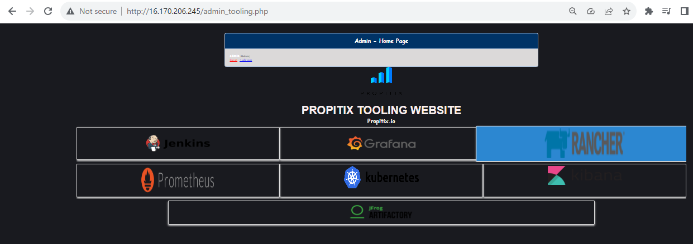
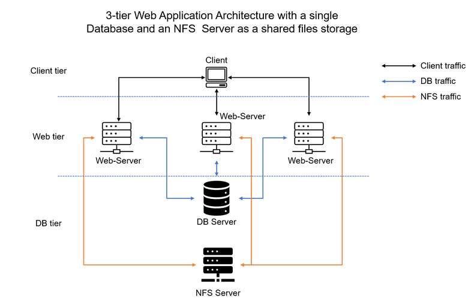
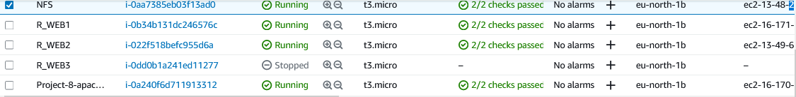

Load Balancer Solution With Apache.
After completing Project-7 you might wonder how a user will be accessing each of the webservers using 3 different IP address or 3 different DNS names. You might also wonder what is the point of having 3 different servers doing exactly the same thing.

When we access a website in the Internet we use an URL and we do not really know how many servers are out there serving our requests, this complexity is hidden from a regular user, but in case of websites that are being visited by millions of users per day (like Google or Reddit) it is impossible to serve all the users from a single Web Server (it is also applicable to databases, but for now we will not focus on distributed DBs).

Each URL contains a domain name part, which is translated (resolved) to IP address of a target server that will serve requests when open a website in the Internet. Translation (resolution) of domain names is perormed by DNS servers, the most commonly used one has a public IP address 8.8.8.8 and belongs to Google. You can try to query it with nslookup command:
nslookup 8.8.8.8
Server:  UnKnown
Address:  103.86.99.99

Name:    dns.google
Address:  8.8.8.8

When you have just one Web server and load increases – you want to serve more and more customers, you can add more CPU and RAM or completely replace the server with a more powerful one – this is called “vertical scaling”. This approach has limitations – at some point you reach the maximum capacity of CPU and RAM that can be installed into your server.

Another approach used to cater for increased traffic is “horizontal scaling” – distributing load across multiple Web servers. This approach is much more common and can be applied almost seamlessly and almost infinitely (you can imagine how many server Google has to serve billions of search requests).

Horizontal scaling allows to adapt to current load by adding (scale out) or removing (scale in) Web servers. Adjustment of number of servers can be done manually or automatically (for example, based on some monitored metrics like CPU and Memory load).

Property of a system (in our case it is Web tier) to be able to handle growing load by adding resources, is called “Scalability”.

In our set up in Project-7 we had 3 Web Servers and each of them had its own public IP address and public DNS name. A client has to access them by using different URLs, which is not a nice user experience to remember addresses/names of even 3 server, let alone millions of Google servers.

In order to hide all this complexity and to have a single point of access with a single public IP address/name, a Load Balancer can be used. A Load Balancer (LB) distributes clients’ requests among underlying Web Servers and makes sure that the load is distributed in an optimal way.

Side Self Study:
Read about different Load Balancing concepts and difference between L4 Network LB and L7 Application LB.

Let us take a look at the updated solution architecture with an LB added on top of Web Servers (for simplicity let us assume it is a software L7 Application LB, for example – Apache, NGINX or HAProxy).

nslookup 8.8.8.8
Server:  UnKnown
Address:  192.168.78.51

Name:    dns.google
Address:  8.8.8.8

    Open TCP port 80 on Project-8-apache-lb by creating an Inbound Rule in Security Group.
    Install Apache Load Balancer on Project-8-apache-lb server and configure it to point traffic coming to LB to both Web Servers:

#Install apache2
sudo apt update
sudo apt install apache2 -y
sudo apt-get install libxml2-dev -y
#Enable following modules:
sudo a2enmod rewrite
sudo a2enmod proxy
sudo a2enmod proxy_balancer
sudo a2enmod proxy_http
sudo a2enmod headers
sudo a2enmod lbmethod_bytraffic

#Restart apache2 service
sudo systemctl restart apache2

ubuntu@ip-172-31-35-207:~$ sudo systemctl status apache2
● apache2.service - The Apache HTTP Server
     Loaded: loaded (/lib/systemd/system/apache2.service; enabled; vendor preset: enabled)
     Active: active (running) since Thu 2023-09-14 11:37:37 UTC; 1min 2s ago
       Docs: https://httpd.apache.org/docs/2.4/
    Process: 32280 ExecStart=/usr/sbin/apachectl start (code=exited, status=0/SUCCESS)
   Main PID: 32284 (apache2)
      Tasks: 55 (limit: 1111)
     Memory: 5.2M
        CPU: 30ms
     CGroup: /system.slice/apache2.service
             ├─32284 /usr/sbin/apache2 -k start
             ├─32285 /usr/sbin/apache2 -k start
             └─32286 /usr/sbin/apache2 -k start

Sep 14 11:37:37 ip-172-31-35-207 systemd[1]: Starting The Apache HTTP Server...
Sep 14 11:37:37 ip-172-31-35-207 systemd[1]: Started The Apache HTTP Server.
So, apache2 is up and running.

Configure load balancing
sudo vi /etc/apache2/sites-available/000-default.conf

#Add this configuration into this section <VirtualHost *:80>  </VirtualHost>

<Proxy "balancer://mycluster">
               BalancerMember http://<WebServer1-Private-IP-Address>:80 loadfactor=5 timeout=1
               BalancerMember http://<WebServer2-Private-IP-Address>:80 loadfactor=5 timeout=1
               ProxySet lbmethod=bytraffic
               # ProxySet lbmethod=byrequests
        </Proxy>

        ProxyPreserveHost On
        ProxyPass / balancer://mycluster/
        ProxyPassReverse / balancer://mycluster/

#Restart apache server

sudo systemctl restart apache2
So, what this configuration is telling the Apache2 server is to map the private IP address to 
