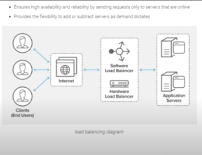
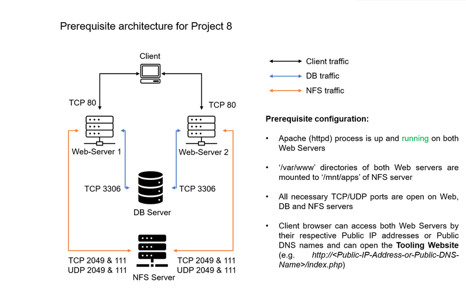

Load Balancer Solution With Apache.
After completing Project-7 you might wonder how a user will be accessing each of the webservers using 3 different IP address or 3 different DNS names. You might also wonder what is the point of having 3 different servers doing exactly the same thing.

When we access a website in the Internet we use an URL and we do not really know how many servers are out there serving our requests, this complexity is hidden from a regular user, but in case of websites that are being visited by millions of users per day (like Google or Reddit) it is impossible to serve all the users from a single Web Server (it is also applicable to databases, but for now we will not focus on distributed DBs).

Each URL contains a domain name part, which is translated (resolved) to IP address of a target server that will serve requests when open a website in the Internet. Translation (resolution) of domain names is perormed by DNS servers, the most commonly used one has a public IP address 8.8.8.8 and belongs to Google. You can try to query it with nslookup command:
nslookup 8.8.8.8
Server:  UnKnown
Address:  103.86.99.99

Name:    dns.google
Address:  8.8.8.8

When you have just one Web server and load increases – you want to serve more and more customers, you can add more CPU and RAM or completely replace the server with a more powerful one – this is called “vertical scaling”. This approach has limitations – at some point you reach the maximum capacity of CPU and RAM that can be installed into your server.

Another approach used to cater for increased traffic is “horizontal scaling” – distributing load across multiple Web servers. This approach is much more common and can be applied almost seamlessly and almost infinitely (you can imagine how many server Google has to serve billions of search requests).

Horizontal scaling allows to adapt to current load by adding (scale out) or removing (scale in) Web servers. Adjustment of number of servers can be done manually or automatically (for example, based on some monitored metrics like CPU and Memory load).

Property of a system (in our case it is Web tier) to be able to handle growing load by adding resources, is called “Scalability”.

In our set up in Project-7 we had 3 Web Servers and each of them had its own public IP address and public DNS name. A client has to access them by using different URLs, which is not a nice user experience to remember addresses/names of even 3 server, let alone millions of Google servers.

In order to hide all this complexity and to have a single point of access with a single public IP address/name, a Load Balancer can be used. A Load Balancer (LB) distributes clients’ requests among underlying Web Servers and makes sure that the load is distributed in an optimal way.

Side Self Study:
Read about different Load Balancing concepts and difference between L4 Network LB and L7 Application LB.

Let us take a look at the updated solution architecture with an LB added on top of Web Servers (for simplicity let us assume it is a software L7 Application LB, for example – Apache, NGINX or HAProxy).

nslookup 8.8.8.8
Server:  UnKnown
Address:  192.168.78.51

Name:    dns.google
Address:  8.8.8.8

    Open TCP port 80 on Project-8-apache-lb by creating an Inbound Rule in Security Group.
    Install Apache Load Balancer on Project-8-apache-lb server and configure it to point traffic coming to LB to both Web Servers:

#Install apache2
sudo apt update
sudo apt install apache2 -y
sudo apt-get install libxml2-dev -y
#Enable following modules:
sudo a2enmod rewrite
sudo a2enmod proxy
sudo a2enmod proxy_balancer
sudo a2enmod proxy_http
sudo a2enmod headers
sudo a2enmod lbmethod_bytraffic

#Restart apache2 service
sudo systemctl restart apache2

ubuntu@ip-172-31-35-207:~$ sudo systemctl status apache2
● apache2.service - The Apache HTTP Server
     Loaded: loaded (/lib/systemd/system/apache2.service; enabled; vendor preset: enabled)
     Active: active (running) since Thu 2023-09-14 11:37:37 UTC; 1min 2s ago
       Docs: https://httpd.apache.org/docs/2.4/
    Process: 32280 ExecStart=/usr/sbin/apachectl start (code=exited, status=0/SUCCESS)
   Main PID: 32284 (apache2)
      Tasks: 55 (limit: 1111)
     Memory: 5.2M
        CPU: 30ms
     CGroup: /system.slice/apache2.service
             ├─32284 /usr/sbin/apache2 -k start
             ├─32285 /usr/sbin/apache2 -k start
             └─32286 /usr/sbin/apache2 -k start

Sep 14 11:37:37 ip-172-31-35-207 systemd[1]: Starting The Apache HTTP Server...
Sep 14 11:37:37 ip-172-31-35-207 systemd[1]: Started The Apache HTTP Server.
So, apache2 is up and running.

Configure load balancing
sudo vi /etc/apache2/sites-available/000-default.conf

#Add this configuration into this section <VirtualHost *:80>  </VirtualHost>

<Proxy "balancer://mycluster">
               BalancerMember http://<WebServer1-Private-IP-Address>:80 loadfactor=5 timeout=1
               BalancerMember http://<WebServer2-Private-IP-Address>:80 loadfactor=5 timeout=1
               ProxySet lbmethod=bytraffic
               # ProxySet lbmethod=byrequests
        </Proxy>

        ProxyPreserveHost On
        ProxyPass / balancer://mycluster/
        ProxyPassReverse / balancer://mycluster/

#Restart apache server

sudo systemctl restart apache2

http://16.170.206.245/index.php

Projects
Docs

    (STEP 18) PROJECT 8: Load Balancer Solution With Apache

Configure Apache As A Load Balancer
Configure Apache As A Load Balancer

    Create an Ubuntu Server 20.04 EC2 instance and name it Project-8-apache-lb, so your EC2 list will look like 

bytraffic balancing method will distribute incoming load between your Web Servers according to current traffic load. We can control in which proportion the traffic must be distributed by loadfactor parameter.

You can also study and try other methods, like: bybusyness, byrequests, heartbeat

    Verify that our configuration works – try to access your LB’s public IP address or Public DNS name from your browser:

    So, on Web_server1&2 on project7, when we run command sudo tail -f /var/log/httpd/access_log on them on project7 as many as we try to access the webpage the more logs we will have. See below logs from the webserver1&2 after we try to access.

    Note: If in the Project-7 you mounted /var/log/httpd/ from your Web Servers to the NFS server – umount them and make sure that each Web Server has its own log directory. So, run below command to umount
    sudo umount /var/log/httpd

Open two ssh/Putty consoles for both Web Servers and run following command:

sudo tail -f /var/log/httpd/access_log
This will show us the machine, the browser you are accessing it from, the time you are accessing and more.
102.88.62.85 - - [18/Sep/2023:14:50:44 +0000] "GET /img/kubernetes.png HTTP/1.1" 200 32166 "http://16.171.199.72/admin_tooling.php" "Mozilla/5.0 (Windows NT 10.0; Win64; x64; rv:109.0) Gecko/20100101 Firefox/117.0"
102.88.62.85 - - [18/Sep/2023:14:50:44 +0000] "GET /img/grafana.png HTTP/1.1" 200 14139 "http://16.171.199.72/admin_tooling.php" "Mozilla/5.0 (Windows NT 10.0; Win64; x64; rv:109.0) Gecko/20100101 Firefox/117.0"
102.88.62.67 - - [18/Sep/2023:14:50:44 +0000] "GET /img/rancher.png HTTP/1.1" 200 13649 "http://16.171.199.72/admin_tooling.php" "Mozilla/5.0 (Windows NT 10.0; Win64; x64; rv:109.0) Gecko/20100101 Firefox/117.0"
102.88.62.107 - - [18/Sep/2023:14:50:44 +0000] "GET /img/jenkins.png HTTP/1.1" 200 35495 "http://16.171.199.72/admin_tooling.php" "Mozilla/5.0 (Windows NT 10.0; Win64; x64; rv:109.0) Gecko/20100101 Firefox/117.0"
102.88.62.85 - - [18/Sep/2023:14:50:45 +0000] "GET /img/jfrog.png HTTP/1.1" 200 62998 "http://16.171.199.72/admin_tooling.php" "Mozilla/5.0 (Windows NT 10.0; Win64; x64; rv:109.0) Gecko/20100101 Firefox/117.0"
102.88.62.85 - - [18/Sep/2023:14:50:45 +0000] "GET /img/kibana.png HTTP/1.1" 200 43059 "http://16.171.199.72/admin_tooling.php" "Mozilla/5.0 (Windows NT 10.0; Win64; x64; rv:109.0) Gecko/20100101 Firefox/117.0"
102.88.35.180 - - [18/Sep/2023:14:50:44 +0000] "GET /img/logo-propitix.png HTTP/1.1" 200 100576 "http://16.171.199.72/admin_tooling.php" "Mozilla/5.0 (Windows NT 10.0; Win64; x64; rv:109.0) Gecko/20100101 Firefox/117.0"
102.88.35.180 - - [18/Sep/2023:14:50:45 +0000] "GET /favicon.ico HTTP/1.1" 404 196 "http://16.171.199.72/admin_tooling.php" "Mozilla/5.0 (Windows NT 10.0; Win64; x64; rv:109.0) Gecko/20100101 Firefox/117.0"
102.88.62.85 - - [18/Sep/2023:14:54:48 +0000] "GET /admin_tooling.php HTTP/1.1" 200 2307 "-" "Mozilla/5.0 (Windows NT 10.0; Win64; x64; rv:109.0) Gecko/20100101 Firefox/117.0"
102.88.62.107 - - [18/Sep/2023:14:54:48 +0000] "GET /favicon.ico HTTP/1.1" 404 196 "http://16.171.199.72/admin_tooling.php" "Mozilla/5.0 (Windows NT 10.0; Win64; x64; rv:109.0) Gecko/20100101 Firefox/117.0"
172.31.35.207 - - [18/Sep/2023:14:56:58 +0000] "GET /.env HTTP/1.1" 404 196 "-" "Mozilla/5.0 (X11; Linux x86_64) AppleWebKit/537.36 (KHTML, like Gecko) Chrome/81.0.4044.129 Safari/537.36"
172.31.35.207 - - [18/Sep/2023:14:56:59 +0000] "POST / HTTP/1.1" 302 2455 "-" "Mozilla/5.0 (X11; Linux x86_64) AppleWebKit/537.36 (KHTML, like Gecko) Chrome/81.0.4044.129 Safari/537.36"
135.125.246.110 - - [18/Sep/2023:15:11:02 +0000] "GET /.env HTTP/1.1" 404 196 "-" "Mozilla/5.0 (X11; Linux x86_64) AppleWebKit/537.36 (KHTML, like Gecko) Chrome/81.0.4044.129 Safari/537.36"
135.125.246.110 - - [18/Sep/2023:15:11:02 +0000] "POST / HTTP/1.1" 302 2455 "-" "Mozilla/5.0 (X11; Linux x86_64) AppleWebKit/537.36 (KHTML, like Gecko) Chrome/81.0.4044.129 Safari/537.36"
172.31.35.207 - - [18/Sep/2023:15:16:31 +0000] "GET / HTTP/1.1" 302 2455 "-" "Mozilla/5.0 (Windows NT 10.0; Win64; x64; rv:109.0) Gecko/20100101 Firefox/117.0"
172.31.35.207 - - [18/Sep/2023:15:16:32 +0000] "GET /style.css HTTP/1.1" 200 1704 "http://16.170.206.245/login.php" "Mozilla/5.0 (Windows NT 10.0; Win64; x64; rv:109.0) Gecko/20100101 Firefox/117.0"
172.31.35.207 - - [18/Sep/2023:15:16:44 +0000] "GET /admin_tooling.php HTTP/1.1" 302 2027 "http://16.170.206.245/login.php" "Mozilla/5.0 (Windows NT 10.0; Win64; x64; rv:109.0) Gecko/20100101 Firefox/117.0"

[ec2-user@ip-172-31-40-91 ~]$ sudo tail -f /var/log/httpd/access_log
94.183.159.75 - - [18/Sep/2023:11:39:50 +0000] "GET / HTTP/1.1" 302 2455 "-" "Mozilla/5.0 (Windows NT 10.0; WOW64) AppleWebKit/537.36 (KHTML, like Gecko) Chrome/52.0.2743.116 Safari/537.36"
185.254.196.173 - - [18/Sep/2023:12:05:05 +0000] "GET /.env HTTP/1.1" 404 196 "-" "Mozilla/5.0 (X11; Linux x86_64) AppleWebKit/537.36 (KHTML, like Gecko) Chrome/81.0.4044.129 Safari/537.36"
185.254.196.173 - - [18/Sep/2023:12:05:05 +0000] "POST / HTTP/1.1" 302 2455 "-" "Mozilla/5.0 (X11; Linux x86_64) AppleWebKit/537.36 (KHTML, like Gecko) Chrome/81.0.4044.129 Safari/537.36"
43.154.8.109 - - [18/Sep/2023:12:11:41 +0000] "HEAD /Core/Skin/Login.aspx HTTP/1.1" 404 - "-" "Mozilla/5.0 (Windows NT 10.0; Win64; x64) AppleWebKit/537.36 (KHTML, like Gecko) Chrome/106.0.0.0 Safari/537.36"
92.118.39.40 - - [18/Sep/2023:13:05:27 +0000] "GET / HTTP/1.1" 302 2455 "-" "-"
66.240.236.116 - - [18/Sep/2023:13:17:28 +0000] "GET / HTTP/1.1" 302 2455 "-" "Mozilla/5.0 zgrab/0.x"
185.254.196.186 - - [18/Sep/2023:13:37:05 +0000] "GET /.env HTTP/1.1" 404 196 "-" "Mozilla/5.0 (X11; Linux x86_64) AppleWebKit/537.36 (KHTML, like Gecko) Chrome/81.0.4044.129 Safari/537.36"
185.254.196.186 - - [18/Sep/2023:13:37:05 +0000] "POST / HTTP/1.1" 302 2455 "-" "Mozilla/5.0 (X11; Linux x86_64) AppleWebKit/537.36 (KHTML, like Gecko) Chrome/81.0.4044.129 Safari/537.36"
43.154.8.109 - - [18/Sep/2023:13:45:41 +0000] "HEAD /Core/Skin/Login.aspx HTTP/1.1" 404 - "-" "Mozilla/5.0 (Windows NT 10.0; Win64; x64) AppleWebKit/537.36 (KHTML, like Gecko) Chrome/106.0.0.0 Safari/537.36"
188.94.32.94 - - [18/Sep/2023:14:09:58 +0000] "GET / HTTP/1.1" 302 2455 "-" "Mozilla/5.0 (Windows NT 10.0; WOW64) AppleWebKit/537.36 (KHTML, like Gecko) Chrome/51.0.2704.103 Safari/537.36"102.88.62.67 - - [18/Sep/2023:14:51:30 +0000] "GET / HTTP/1.1" 302 2455 "-" "Mozilla/5.0 (Windows NT 10.0; Win64; x64; rv:109.0) Gecko/20100101 Firefox/117.0"
102.88.62.67 - - [18/Sep/2023:14:51:30 +0000] "GET /login.php HTTP/1.1" 200 715 "-" "Mozilla/5.0 (Windows NT 10.0; Win64; x64; rv:109.0) Gecko/20100101 Firefox/117.0"
102.88.62.85 - - [18/Sep/2023:14:51:30 +0000] "GET /style.css HTTP/1.1" 200 1704 "http://13.49.68.150/login.php" "Mozilla/5.0 (Windows NT 10.0; Win64; x64; rv:109.0) Gecko/20100101 Firefox/117.0"
102.88.62.67 - - [18/Sep/2023:14:51:30 +0000] "GET /favicon.ico HTTP/1.1" 404 196 "http://13.49.68.150/login.php" "Mozilla/5.0 (Windows NT 10.0; Win64; x64; rv:109.0) Gecko/20100101 Firefox/117.0"
102.88.62.85 - - [18/Sep/2023:14:51:51 +0000] "POST /login.php HTTP/1.1" 302 715 "http://13.49.68.150/login.php" "Mozilla/5.0 (Windows NT 10.0; Win64; x64; rv:109.0) Gecko/20100101 Firefox/117.0"
102.88.62.85 - - [18/Sep/2023:14:51:51 +0000] "GET /admin_tooling.php HTTP/1.1" 200 2396 "http://13.49.68.150/login.php" "Mozilla/5.0 (Windows NT 10.0; Win64; x64; rv:109.0) Gecko/20100101 Firefox/117.0"
102.88.62.85 - - [18/Sep/2023:14:51:51 +0000] "GET /tooling_stylesheets.css HTTP/1.1" 200 1027 "http://13.49.68.150/admin_tooling.php" "Mozilla/5.0 (Windows NT 10.0; Win64; x64; rv:109.0) Gecko/20100101 Firefox/117.0"
102.88.35.153 - - [18/Sep/2023:14:51:51 +0000] "GET /img/grafana.png HTTP/1.1" 200 14139 "http://13.49.68.150/admin_tooling.php" "Mozilla/5.0 (Windows NT 10.0; Win64; x64; rv:109.0) Gecko/20100101 Firefox/117.0"
102.88.62.107 - - [18/Sep/2023:14:51:51 +0000] "GET /img/kubernetes.png HTTP/1.1" 200 32166 "http://13.49.68.150/admin_tooling.php" "Mozilla/5.0 (Windows NT 10.0; Win64; x64; rv:109.0) Gecko/20100101 Firefox/117.0"
102.88.62.67 - - [18/Sep/2023:14:51:51 +0000] "GET /img/kibana.png HTTP/1.1" 200 43059 "http://13.49.68.150/admin_tooling.php" "Mozilla/5.0 (Windows NT 10.0; Win64; x64; rv:109.0) Gecko/20100101 Firefox/117.0"
102.88.62.85 - - [18/Sep/2023:14:51:51 +0000] "GET /img/rancher.png HTTP/1.1" 200 13649 "http://13.49.68.150/admin_tooling.php" "Mozilla/5.0 (Windows NT 10.0; Win64; x64; rv:109.0) Gecko/20100101 Firefox/117.0"
102.88.35.180 - - [18/Sep/2023:14:51:51 +0000] "GET /img/jenkins.png HTTP/1.1" 200 35495 "http://13.49.68.150/admin_tooling.php" "Mozilla/5.0 (Windows NT 10.0; Win64; x64; rv:109.0) Gecko/20100101 Firefox/117.0"
102.88.35.153 - - [18/Sep/2023:14:51:52 +0000] "GET /img/prometheus.png HTTP/1.1" 200 22884 "http://13.49.68.150/admin_tooling.php" "Mozilla/5.0 (Windows NT 10.0; Win64; x64; rv:109.0) Gecko/20100101 Firefox/117.0"
102.88.35.153 - - [18/Sep/2023:14:51:51 +0000] "GET /img/logo-propitix.png HTTP/1.1" 200 100576 "http://13.49.68.150/admin_tooling.php" "Mozilla/5.0 (Windows NT 10.0; Win64; x64; rv:109.0) Gecko/20100101 Firefox/117.0"
102.88.35.180 - - [18/Sep/2023:14:51:52 +0000] "GET /img/jfrog.png HTTP/1.1" 200 62998 "http://13.49.68.150/admin_tooling.php" "Mozilla/5.0 (Windows NT 10.0; Win64; x64; rv:109.0) Gecko/20100101 Firefox/117.0"

 Try to refresh your browser page http://<Load-Balancer-Public-IP-Address-or-Public-DNS-Name>/index.php several times and make sure that both servers receive HTTP GET requests from your LB – new records must appear in each server’s log file. The number of requests to each server will be approximately the same since we set loadfactor to the same value for both servers – it means that traffic will be disctributed evenly between them.

If you have configured everything correctly – your users will not even notice that their requests are served by more than one server.

Optional Step – Configure Local DNS Names Resolution

Sometimes it is tedious to remember and switch between IP addresses, especially if you have a lot of servers under your management.
What we can do, is to configure local domain name resolution. The easiest way is to use /etc/hosts file, although this approach is not very scalable, but it is very easy to configure and shows the concept well. So let us configure IP address to domain name mapping for our LB.

So, to configure local domain name resolution, use below command on the load balancer(LB)
sudo vi /etc/hosts

sudo vi /etc/apache2/sites-available/000-default.conf

So, to call our client URL of R_WEB1&R_WEB2
ubuntu@ip-172-31-35-207:~$ curl http://R_WEB1

<!DOCTYPE html>

<html>

<head>
    <meta charset="utf-8">
    <meta name="viewport" content="width=device-width, initial-scale=1">
    <link rel="stylesheet" type="text/css" href="tooling_stylesheets.css">
    
    <title> PROPITIX TOOLING</title>
</head>

<body>

        

        

                <!-- notification message -->
                                <!-- logged in user information -->
                

                <!--     -->

                        

                                                        

                

        

    

        
    

   

    <h1> PROPITIX TOOLING WEBSITE </h1>
    <h2 id="test">Propitix.io</h2>

    
    

        

            
        

        

            

        

        

            
        

    

     

        

            
        

        

            

        

        

            
        

    

    

        

            

        

    

    </section>

</body>

So, this means the local name of this name resolution of load balancer worked for R_WEB1

To, check for R_WEB2
</html>ubuntu@ip-172-31-35-207:~$ ^C
ubuntu@ip-172-31-35-207:~$ curl http://R_WEB2

<!DOCTYPE html>

<html>

<head>
    <meta charset="utf-8">
    <meta name="viewport" content="width=device-width, initial-scale=1">
    <link rel="stylesheet" type="text/css" href="tooling_stylesheets.css">
    
    <title> PROPITIX TOOLING</title>
</head>

<body>

        

        

                <!-- notification message -->
                                <!-- logged in user information -->
                

                <!--     -->

                        

                                                        

                

        

    

        
    

   

    <h1> PROPITIX TOOLING WEBSITE </h1>
    <h2 id="test">Propitix.io</h2>

    
    

        

            
        

        

            

        

        

            
        

    

     

        

            
        

        

            

        

        

            
        

    

    

        

            

        

    

    </section>

</body>

So, we were able to achiev this architecture

